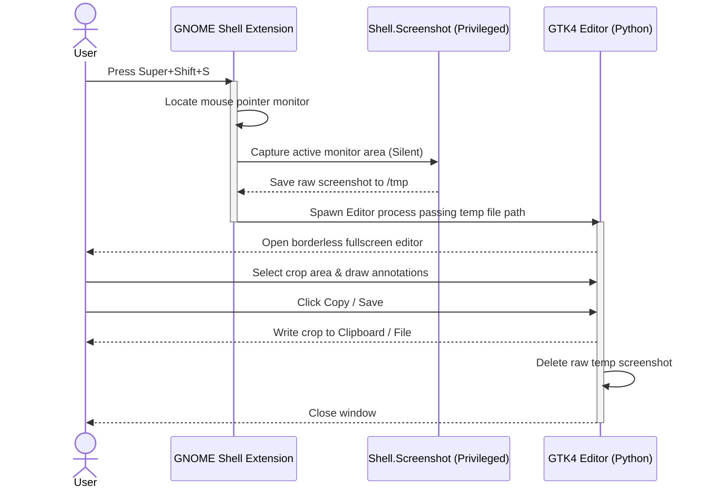

# BoomerShot 📸

BoomerShot is a premium screenshot and snipping tool built specifically for **GNOME + Wayland**. 

Wayland blocks standard user-space apps from capturing the screen silently. BoomerShot solves this with a **hybrid architecture** that packages a privileged GNOME Shell Extension alongside a modern GTK4/Cairo editor.

## ✨ Features

- **Instant Silent Capture:** Bypasses Wayland security prompts by delegating screen capture to a local, privileged GNOME Shell extension.
- **DPI-Aware Canvas:** Automatically scales the screen grab to the physical resolution of high-DPI (Retina/4K) monitors for crisp, pixel-perfect crops.
- **Multi-Monitor Friendly:** Tracks the mouse pointer and only captures/displays on the active screen, avoiding multi-monitor stretching.
- **Rich Annotations:** 
  - Freehand Pen tool
  - Dynamic Arrow drawer (with automatic arrow heads)
  - Rectangle tool
  - Text insertion tool (using Gtk.Entry overlaid on Cairo drawing)
  - **Retro Pixelation Blur:** Pixelates sensitive information using native Cairo scaling with a `NEAREST` filter (zero external dependencies like PIL or OpenCV).
- **Clipboard & File Save:** Copies crops directly to the Wayland clipboard or saves them via GNOME's modern `Gtk.FileDialog`.
- **Keyboard Shortcuts:**
  - `Super+Shift+S`: Interactive Snipping tool (select crop and edit)
  - `Super+Shift+W`: Capture active window directly and annotate it
  - `Ctrl+C` or `Enter` (inside editor): Copy crop to clipboard and exit
  - `Ctrl+S` (inside editor): Save crop to file and exit
  - `Ctrl+Z`: Undo last drawing action
  - `Esc`: Cancel/Close editor

## 🛠 Tech Stack

- **GNOME Shell Extension:** JavaScript (ESM, GNOME 50+)
- **Editor GUI:** Python 3 + PyGObject (GTK4 + Libadwaita + Cairo vector drawing)
- **Styling:** Custom CSS stylesheet (`src/style.css`) with glassmorphic designs

---

## 🚀 Installation & Setup

1. **Prerequisites:** Ensure you have the python D-Bus and GTK4 bindings:
   ```bash
   sudo apt install python3-gi python3-cairo gir1.2-gtk-4.0 gir1.2-adw-1
   ```

2. **Install BoomerShot:**
   Clone the repository and run:
   ```bash
   make install
   ```
   *Note: This installs the extension into `~/.local/share/gnome-shell/extensions/` and compiles the GSettings schemas.*

3. **Activate the extension:**
   Because GNOME Shell only detects newly installed local extensions on startup, you **MUST Log Out and Log Back In** (or restart your session) for GNOME to register the extension.
   
   Once you log back in, check your extensions (e.g. using `Extensions` app or `gnome-extensions list`) to make sure **BoomerShot Helper** is enabled.

---

## 🔧 How it Works



## 📜 License

MIT License. Developed by DeluluDev.
