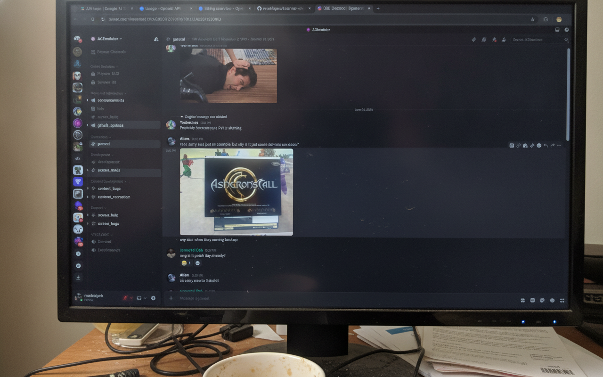

# BoomerShot 📸👴

Screenshots that look like they were taken by your grandpa.



Screenshot/snipping tool shell extension built for GNOME + Wayland.

AI is optional. Also works as a normal offline screenshot tool if you don't configure any AI keys.

---

## 🚀 Installation & Setup

### 1. Install BoomerShot
Clone the repository and run the installer:
```bash
git clone https://github.com/merklejerk/boomer-shot.git
cd boomer-shot
make install
```
*Note: This installs the extension into `~/.local/share/gnome-shell/extensions/`, creates a CLI wrapper at `~/.local/bin/boomer-shot`, and compiles the GSettings schemas.*

### 2. Activate the Extension
GNOME Shell only detects newly installed local extensions on startup. You **MUST Log Out and Log Back In** (or restart your session) for GNOME to register the extension.

Once logged back in, enable the **BoomerShot Helper** in the Extensions app or run:
```bash
make enable
```

### ⌨️ Global Shortcuts

Trigger BoomerShot from anywhere on your desktop:
*   `Super+Shift+S`: Select a custom crop area.
*   `Super+Shift+W`: Capture the active window directly.

To customize these shortcuts, use `gsettings` from your terminal:
```bash
# Change crop area shortcut (e.g. to Super+Shift+P)
gsettings set org.gnome.shell.extensions.boomer-shot snip-area "['<Super><Shift>p']"

# Change active window shortcut (e.g. to Super+Shift+O)
gsettings set org.gnome.shell.extensions.boomer-shot snip-window "['<Super><Shift>o']"
```
Or navigate to `/org/gnome/shell/extensions/boomer-shot/` inside **Dconf Editor** to modify them visually.

### 🔍 Troubleshooting (Missing System Dependencies)
Most modern GNOME + Wayland setups come with PyGObject, Cairo, and GTK4 pre-installed. However, if the editor fails to launch or complains about missing Python bindings, you can install them manually:

```bash
# Arch Linux
sudo pacman -S python-gobject python-cairo gtk4 libadwaita

# Ubuntu / Debian
sudo apt install python3-gi python3-cairo gir1.2-gtk-4.0 gir1.2-adw-1
```

---

## ✨ Features

*   **Instant Silent Capture:** Captures the screen area silently using the GNOME Shell extension.
*   **DPI-Aware Canvas:** Automatically scales the screen grab to the physical resolution of high-DPI (Retina/4K) monitors so your crops are crisp and pixel-perfect.
*   **Multi-Monitor Friendly:** Tracks your pointer and only captures/displays on the active screen, avoiding multi-monitor stretching.
*   **Rich Annotations:**
    *   Freehand Pen tool
    *   Dynamic Arrow drawer (with automatic arrow heads)
    *   Rectangle tool
    *   Text insertion tool (using Gtk.Entry overlaid on Cairo drawing)
    *   **Retro Pixelation Blur:** Pixelates sensitive information using native Cairo scaling with a `NEAREST` filter (zero external dependencies like PIL or OpenCV).
*   **"Boomer-fy" AI Filter:** Uses Gemini (`gemini-2.5-flash-image`) or OpenAI (`gpt-image-2`) via zero-dependency raw REST HTTP queries to transform your screenshot into a low-quality smartphone picture of a computer screen (glare, reflections, moiré patterns, and slight tilts included!).
*   **Clipboard & File Save:** Copies crops directly to the Wayland clipboard or saves them via GNOME's modern `Gtk.FileDialog`.

---

## 🛠 Tech Stack

BoomerShot uses a hybrid architecture: a GNOME Shell extension handles the privileged screen capture to bypass Wayland's security dialogs, while a GTK4 Python client presents the editor GUI.

*   **GNOME Shell Extension:** JavaScript (ESM, GNOME 50+)
*   **Editor GUI:** Python 3 + PyGObject (GTK4 + Libadwaita + Cairo vector drawing)
*   **Styling:** Custom CSS stylesheet (`src/style.css`)
*   **Zero-Dependency APIs:** Raw REST HTTP requests to Gemini/OpenAI using only standard library `urllib` (no `google-genai` or `openai` packages needed).

---

## ⌨️ Editor Shortcuts

While inside the GTK4 editor, you can use these shortcuts:
*   `Ctrl+C` or `Enter`: Copy crop to clipboard and exit
*   `Ctrl+S`: Save crop to file and exit
*   `Ctrl+Z`: Undo last drawing action
*   `Esc`: Cancel/Close editor

---

## 🧑‍💻 Development & Contributing

We use `uv` for python environment and dependency management.

### Dev Environment Setup
To set up the environment with system GObject packages available inside the virtualenv:
```bash
make dev-setup
```

### Running Tests & Linters
We take code quality and type safety seriously:
```bash
# Re-format code style
uv run ruff format src/ tests/

# Run the linter
uv run ruff check src/ tests/ --fix

# Run type checker
uv run mypy src

# Run unit tests
uv run pytest tests/
```

### Local Testing (No Extension Trigger)
Test the GTK4 UI directly with a sample PNG:
```bash
uv run python3 src/main.py --mode area --file /path/to/some_image.png
```

---

## ❓ FAQ

**Q: Where general config saved?**  
A: It is stored at `~/.config/boomer-shot/config.json`.

**Q: Where are my API keys saved?**  
A: They are stored securely in the GNOME Keyring (via `libsecret` / `Secret`). 

**Q: The Boomerfy tool failed. Where can I find the details?**  
A: If a request fails, we show an error dialog in the UI and write the full error traceback to `~/.config/boomer-shot/last_error.log` for easy debugging.
